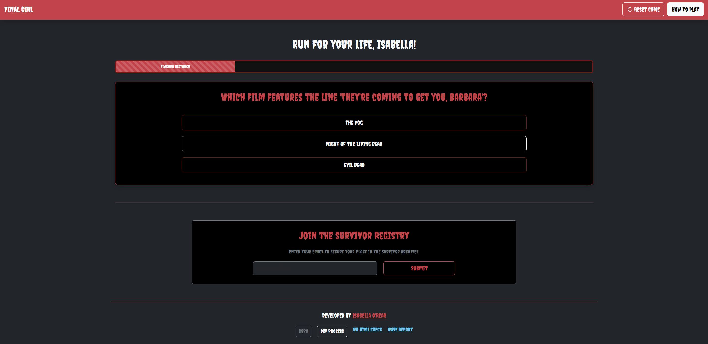
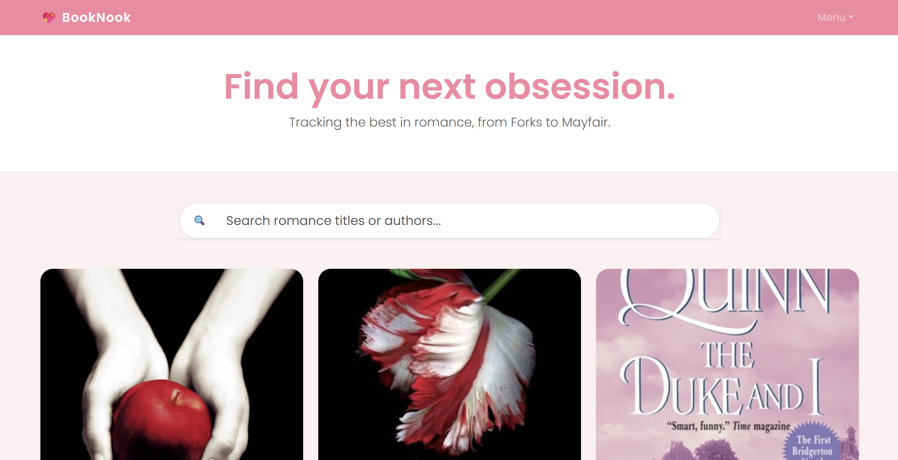

## Hi there :) 

### Programming Languages:

### Socials:

 <a href="https://www.github.com/isabellaorear31-design" target="_blank" rel="noreferrer"> <picture> <source media="(prefers-color-scheme: dark)" srcset="https://raw.githubusercontent.com/danielcranney/readme-generator/main/public/icons/socials/github-dark.svg" /> <source media="(prefers-color-scheme: light)" srcset="https://raw.githubusercontent.com/danielcranney/readme-generator/main/public/icons/socials/github.svg" />  </picture> </a>
  <a href="https://www.linkedin.com/in/orearisabella" target="_blank" rel="noreferrer"> <picture>
  <source media="(prefers-color-scheme: dark)" srcset="https://raw.githubusercontent.com/danielcranney/readme-generator/main/public/icons/socials/linkedin-dark.svg" /> <source media="(prefers-color-scheme: light)" srcset="https://raw.githubusercontent.com/danielcranney/readme-generator/main/public/icons/socials/linkedin.svg" />
 </picture> </a>

### Projects: 

## 🎮 Game Project: Final Girl Horror Trivia (Revised)

**A high-stakes horror trivia game where you must outsmart a slasher to survive the night.**

* [🚀 Play the Game](https://isabellaorear31-design.github.io/horror-trivia/)
* [📂 Source Code](https://github.com/isabellaorear31-design/horror-trivia)

---

## 📚 Project: BookNook

**A romance-focused book discovery and tracking app inspired by Goodreads.**

* [🚀 Launch App](https://isabellaorear31-design.github.io/booknook-app/)
* [📂 Source Code](https://github.com/isabellaorear31-design/booknook-app)

---

<!--
**isabellaorear31-design/isabellaorear31-design** is a ✨ _special_ ✨ repository because its `README.md` (this file) appears on your GitHub profile.
